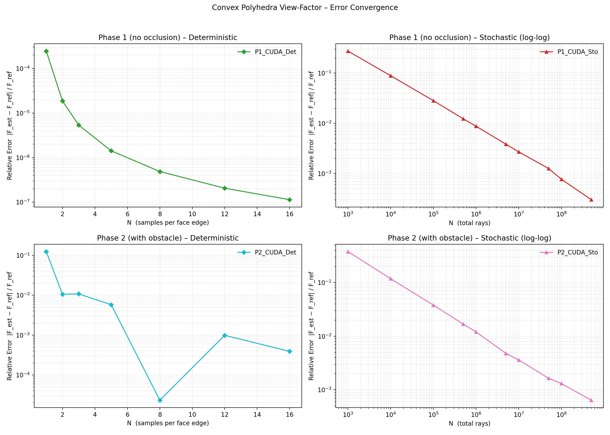
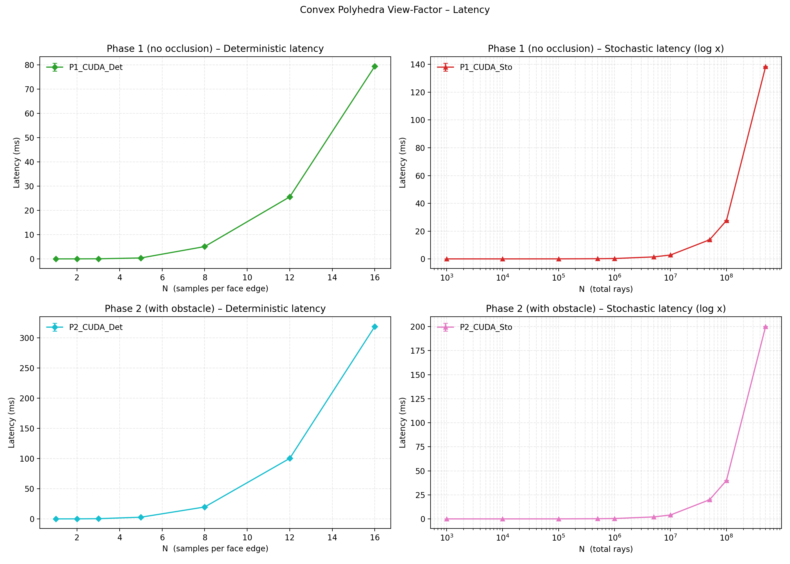
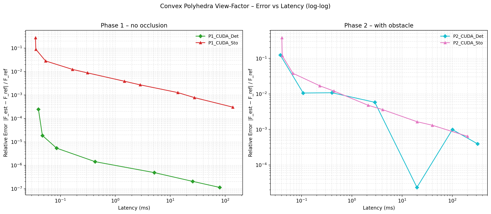

# Convex Polyhedra View-Factor — GPU Benchmark

Estimation of the radiative view factor between two convex polyhedra using GPU-accelerated methods, with and without a visibility obstacle.

## Geometry

Two regular icosahedra (20 triangular faces each, circumradius = 1) centred at `(0,0,0)` and `(0,0,5)`, leaving a surface-to-surface gap of 3 units.

**Phase 2 obstacle:** an axis-aligned box centred at `(0, 0, 2.5)` with half-extents `(0.3, 0.3, 0.3)`, represented as 12 triangles. Its size was chosen to create a significant but partial occlusion — blocking a meaningful fraction of rays without fully shadowing the two bodies.

## Methods

| Name | Type | Description |
|---|---|---|
| `CUDA_Det` | Deterministic | GPU parallelisation of the same double-area integral as `FormFactor()`, evaluated with a stratified N×N quadrature grid per face. One CUDA thread per face pair. |
| `CUDA_Sto` | Stochastic (Monte Carlo) | N rays fired from cosine-weighted hemisphere samples on A; fraction hitting B estimates F. Unbiased estimator. |

**Ground truth — Phase 1:** `FormFactor()` (contour-integral formula, exact for planar polygons) with per-face centroid visibility filtering.

**Ground truth — Phase 2:** `FormFactor()` on a subdivided mesh (`subdivisions=3` → 1280 sub-faces per icosahedron) with per-sub-face Möller–Trumbore occlusion test. This reference is itself a discrete approximation.

> ⚠️ `CUDA_Det` shares the same numerical formulation as the Phase 1 reference, which introduces a favourable bias — its reported errors tend to underestimate the true deviation from the continuous integral.

## Results

### Error Convergence

- **Det (Phase 1):** smooth convergence from ~2.5×10⁻⁴ (N=1) to ~10⁻⁷ (N=16), consistent with O(N⁴) quadrature points per face pair.
- **Sto (Phase 1):** canonical 1/√N Monte Carlo convergence, from ~40% error at 10³ rays down to ~2×10⁻⁴ at 5×10⁸ rays.
- **Det (Phase 2):** non-monotone behaviour with a sharp minimum at N=8 (~2×10⁻⁵). This is likely a coincidence of discretisation — at that N, the quadrature grid and the reference mesh resolve the obstacle geometry similarly ("lucky shot") rather than a genuine convergence effect.
- **Sto (Phase 2):** stable 1/√N convergence down to ~7×10⁻⁴ at 5×10⁸ rays.

### Latency

- Det latency grows steeply with N: sub-millisecond for N ≤ 5, reaching ~80 ms (Phase 1) and ~320 ms (Phase 2) at N=16, due to the O(N⁴) cost of the double quadrature loop.
- Sto latency scales linearly with the number of rays, staying negligible up to ~10⁶ rays before reaching ~140 ms (Phase 1) and ~200 ms (Phase 2) at 5×10⁸ rays.

### Error vs Latency (Pareto)

In Phase 1, `CUDA_Det` achieves several orders of magnitude lower error than `CUDA_Sto` for the same time budget — though this advantage is partly an artefact of the shared formulation with the reference. In Phase 2 the two methods are more comparable, with `CUDA_Sto` offering smoother convergence and `CUDA_Det` showing the non-monotone artefact discussed above.

## Potential Extensions

The current visibility tests (Möller–Trumbore, executed in plain CUDA) could be significantly accelerated using **NVIDIA RT Cores** (Turing/Ampere and later) via the **OptiX API**, which provides hardware-accelerated ray tracing. This would improve both latency and accuracy of the stochastic method in Phase 2.
